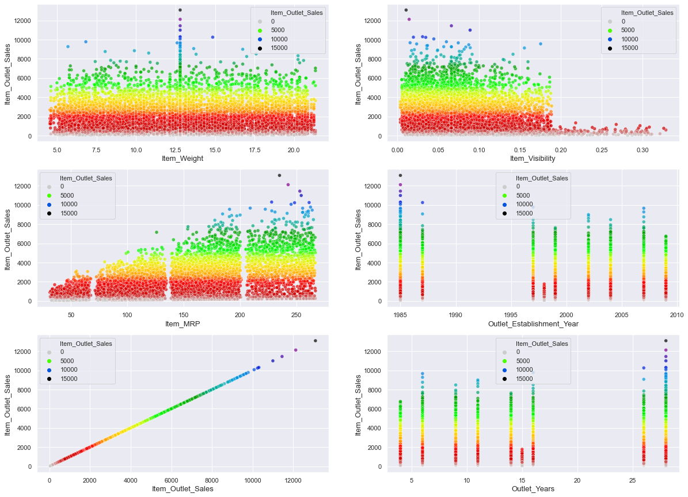
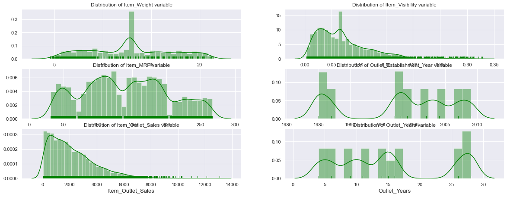
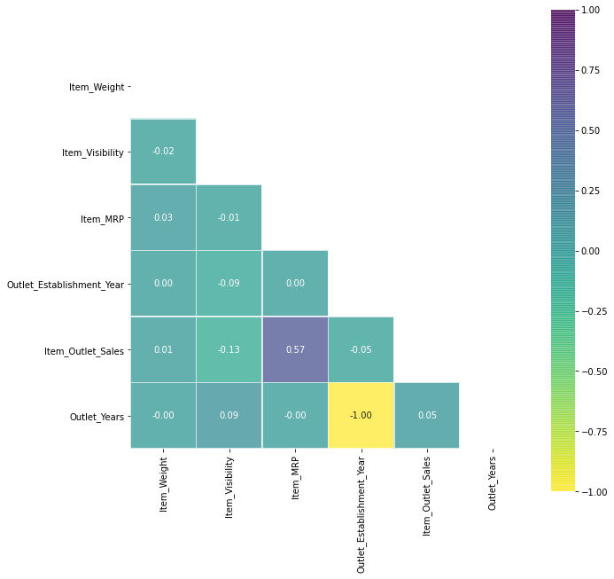
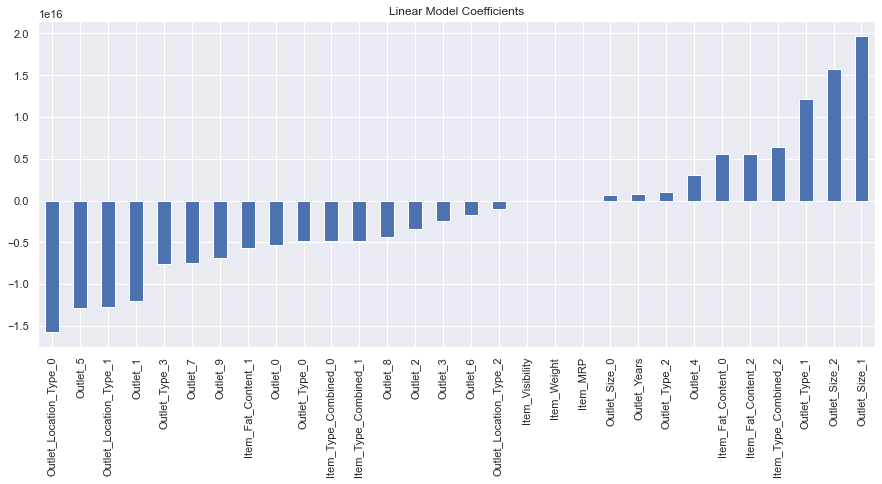
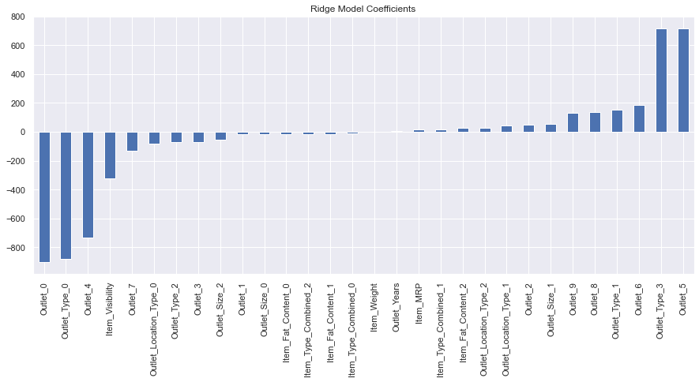
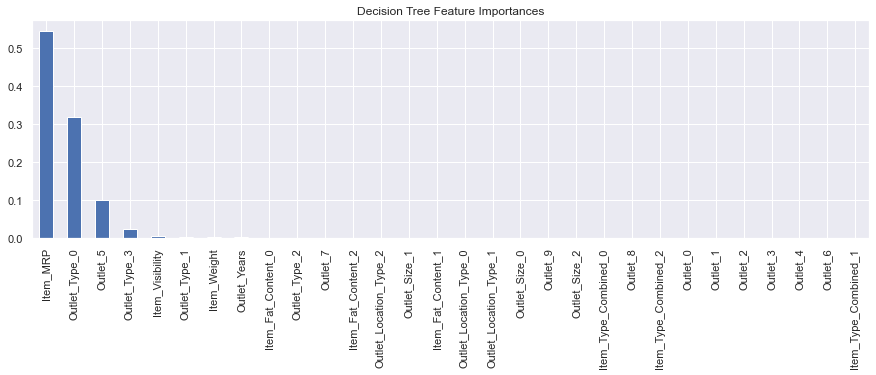

# Predicting sales for retail grocery chain
 In this project, I'm building a simple model to predict the outlet sales of a retail supermarket, using following machine learning algorithms : Linear Regression, decision trees & random forest.
 The python notebook should be self explanatory with comments.
 
## Here are the broad steps taken:
- **Hypothesis Generation** – Understanding the problem and making and hypothesis.
- **Data Exploration** – Exloring and plotting categorical and numerical data, to understand and have an intuition. Here are the few plots 

- **Data Cleaning** – imputing missing values in the data and checking for outliers.
- **Feature Engineering** – modifying existing variables and creating new ones for analysis.
- **Model Building** – making predictive models on the data, Models used Linear Regression, Decision Tree Regressor, Random Forest Regressor.
  

